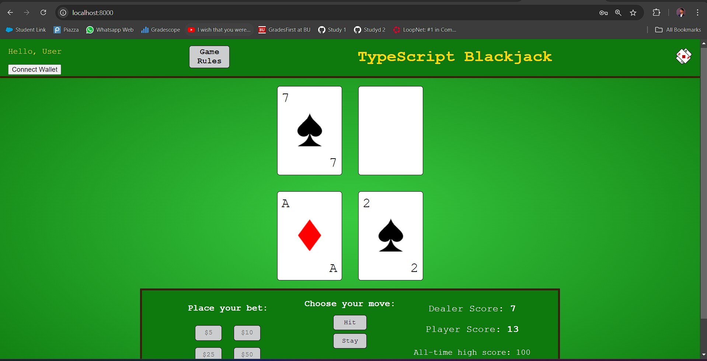
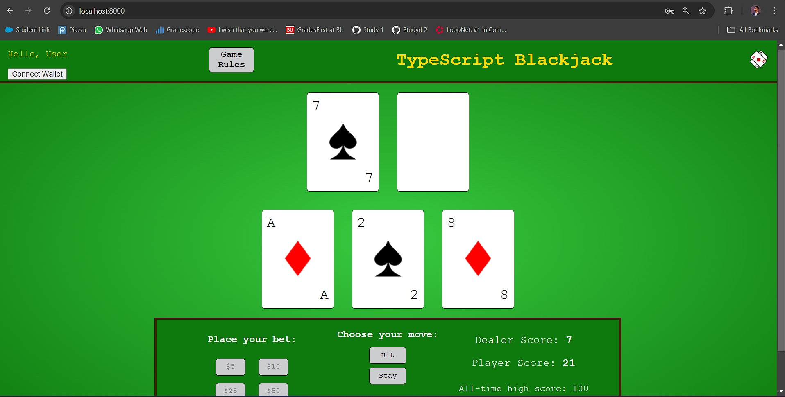
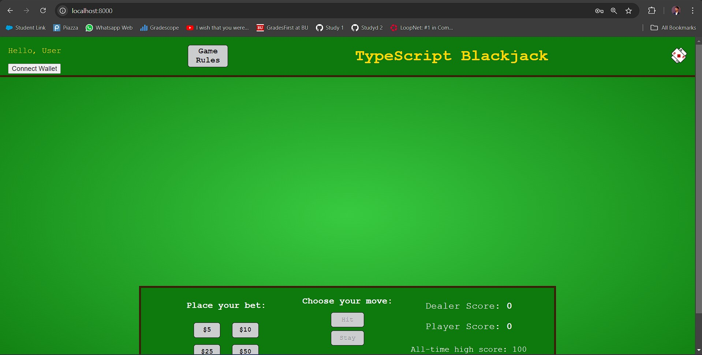
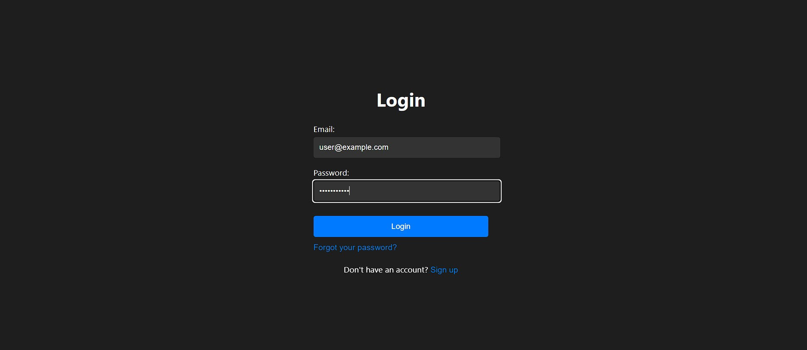
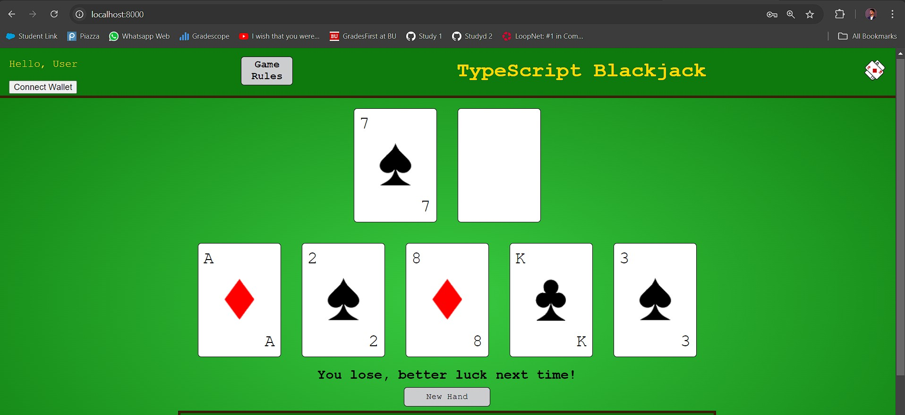
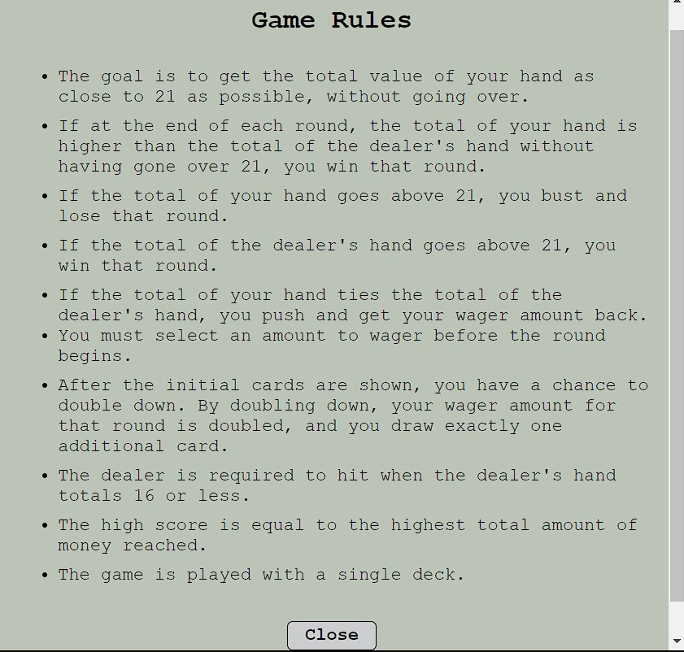
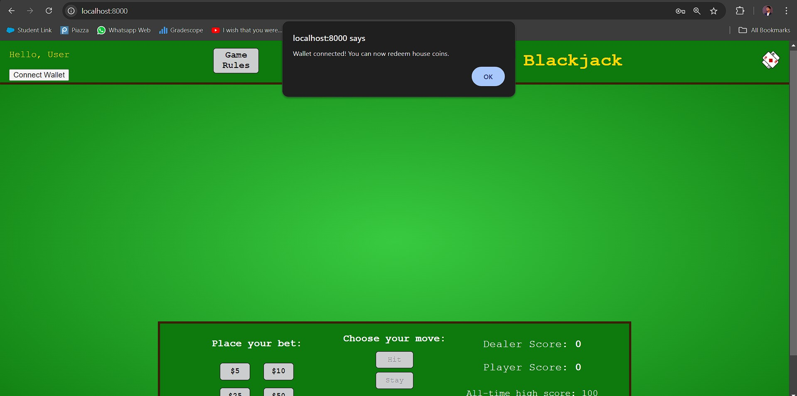

# All-In Casino

Welcome to the new era of online gaming! In a domain plagued by trust issues and opacity, traditional online casinos consistently fall short in delivering a user-centric experience. Players' concerns about game fairness and the security of their funds have long called for a transformative approach. Enter "All-In Casino," which harnesses the power of the Polkadot blockchain to redefine online gambling with unparalleled transparency and reliability.

## Core Technology

At the core of our application is **Substrate**, which enables us to build a blockchain tailored specifically to the requirements of online gaming. This platform is designed to manage aspects like transaction processing and game logic verification.

### Polkadot's Relay Chain

The Relay Chain ensures the overall security of our casino platform as it connects to the Polkadot network. This backbone provides consensus and enables interoperability across chains, crucial for accepting various cryptocurrencies.

### Custom Parachain

We developed a custom gaming parachain using Substrate, allowing the casino to operate autonomously while still benefiting from the shared security and cross-chain interoperability offered by Polkadot. This setup facilitates transaction models specifically tailored for gaming, such as instant bet placements and quick reward distributions.

## Security and Efficiency

By deploying **smart contracts**, we ensure that player balances and bets are managed with the utmost security. These contracts safeguard funds and automate payouts based on actual game outcomes, all executed directly on the blockchain.

### Transaction Handling

Our parachain manages cryptographic transactions, ensuring that player bets and payouts are secure and transparent. Leveraging Polkadot’s multi-chain transaction processing capabilities enhances speed and reduces costs, crucial for a seamless gaming experience.

### Upgradability

The platform utilizes the upgradable nature of Substrate-based parachains to implement updates or new features seamlessly without requiring hard forks. This approach minimizes downtime and maintains continuous user engagement.

### Cross-Chain Functionality

The casino benefits from Polkadot’s cross-chain capabilities, allowing users to interact with other decentralized applications, such as DeFi platforms for additional financial activities like borrowing or staking, directly enhancing the utility and accessibility of the casino’s tokens.

## Conclusion

The result? "All-In Casino" not only heightens security but also optimizes efficiency, setting a new benchmark in the online gambling industry. Join us as we pave the way towards a more transparent and trustworthy gaming environment.

## Resources

- For an overview of our project's vision and design, visit our design page here: [All-In Casino Design](https://www.canva.com/design/DAGMNQvyJSs/pMr3qpymrxGz0QjALwkiGw/edit?utm_content=DAGMNQvyJSs&utm_campaign=designshare&utm_medium=link2&utm_source=sharebutton)
- The frontend login feature of our application is based on an existing implementation by KSmith8888, available on GitHub: [TypeScript Blackjack](https://github.com/KSmith8888/TypeScript-Blackjack). This adaptation was communicated and agreed upon with Luka.

## Images

Below are the images used in our project, located in the `img` directory:

-  - Database Table
-  - First Hand
-  - Hit
-  - Landing Page
-  - Login Page
-  - Lost
-  - Rules
-  - Wallet Connected